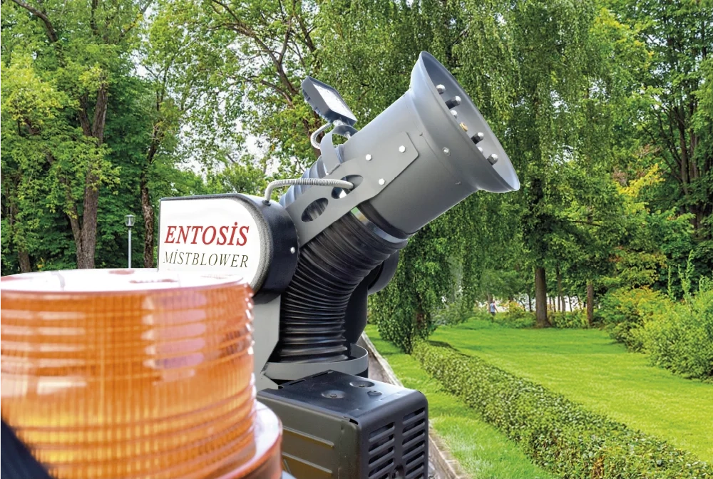

# Canlı Site Performans Teşhis Raporu

- **Alan adı (ölçülen):** `https://www.duruulvteknoloji.com.tr`  
  (İstekteki `https://SITE_URL` yer tutucusunun bu repodaki canlı domain karşılığı)
- **Tarih (UTC):** 2026-08-07 ~10:52
- **Kapsam:** Kod değiştirilmedi; yalnızca dosya okuma + komut + canlı HTTP ölçümü
- **Not:** `emergent/` ve `node_modules` içeriği okunmadı (yalnızca boyut / dosya sayısı)

---

## 1) Konfigürasyon dosyaları (repoda var olanlar)

### Bulunanlar

| Dosya | Durum |
|-------|--------|
| `.htaccess` | VAR |
| `api/.htaccess` | VAR |
| `.gitignore` | VAR |
| `package.json` | VAR |
| `nginx.conf` | YOK |
| site vhost | YOK |
| `_headers` | YOK |
| `_redirects` | YOK |
| `vercel.json` | YOK |
| `netlify.toml` | YOK |
| `next.config.*` | YOK |
| `.deployignore` | YOK |
| `.github/workflows/*.yml` | YOK |
| `deploy.sh` | YOK |
| `Dockerfile` | YOK |

### `.htaccess` (tam içerik)

```
DirectoryIndex index.html
Options -Indexes
AddDefaultCharset UTF-8
ErrorDocument 404 /404.html

<IfModule mod_headers.c>
  Header set X-Content-Type-Options "nosniff"
  Header set X-Frame-Options "SAMEORIGIN"
  Header set Referrer-Policy "strict-origin-when-cross-origin"
  Header always set Strict-Transport-Security "max-age=31536000; includeSubDomains" env=HTTPS
</IfModule>

<IfModule mod_mime.c>
  AddType image/webp .webp
  AddType text/plain .txt
  AddType application/json .json
</IfModule>

<IfModule mod_expires.c>
  ExpiresActive On
  ExpiresByType text/css "access plus 1 year"
  ExpiresByType application/javascript "access plus 1 year"
  ExpiresByType image/webp "access plus 1 year"
  ExpiresByType image/png "access plus 1 year"
  ExpiresByType image/jpeg "access plus 1 year"
  ExpiresByType image/svg+xml "access plus 1 year"
  ExpiresByType application/pdf "access plus 1 month"
  ExpiresByType text/html "access plus 0 seconds"
</IfModule>

<IfModule mod_rewrite.c>
  RewriteEngine On
  RewriteBase /

  # HTTP → HTTPS
  RewriteCond %{HTTPS} !=on
  RewriteRule ^ https://%{HTTP_HOST}%{REQUEST_URI} [R=301,L]

  # non-www → www (canonical ile uyumlu)
  RewriteCond %{HTTP_HOST} !^www\. [NC]
  RewriteRule ^ https://www.%{HTTP_HOST}%{REQUEST_URI} [R=301,L]

  # Eski / örnek dizinler — yayında erişilemez
  RewriteRule ^(yigitornek|emergent)(/|$) - [F,L]

  # /path/index.html → /path/ (canonical ile uyumlu tek URL)
  RewriteCond %{THE_REQUEST} \s/+([^?\s]*/?)index\.html[\s?] [NC]
  RewriteRule ^ %1 [R=301,L]

  # security.txt kök yolu → .well-known (RFC 9116)
  RewriteRule ^security\.txt$ /.well-known/security.txt [R=301,L]
</IfModule>
```

### `api/.htaccess` (tam içerik)

```
<Files "config.php">
    Require all denied
</Files>
<Files "config.example.php">
    Require all denied
</Files>
<Files "mail-error.log">
    Require all denied
</Files>
<Files "mail-smtp.php">
    Require all denied
</Files>
<Files "quote-email-builder.php">
    Require all denied
</Files>

RedirectMatch 403 (?i)^/api/outbox/
```

### `.gitignore` (tam içerik)

```
# Ortam / gizli
api/config.php
api/mail-error.log
api/outbox/
.env
.env.*

# Bağımlılıklar
node_modules/
emergent/frontend/node_modules/

# Önbellek / test
emergent/.pytest_cache/
emergent/.ruff_cache/
emergent/test_reports/
__pycache__/
*.pyc

# IDE / OS
.DS_Store
Thumbs.db
.idea/
.vscode/
*.log
```

### `package.json` (tam içerik)

```
{
  "name": "duruulvteknoloji-site",
  "private": true,
  "scripts": {
    "build:css": "node scripts/build-css.js",
    "optimize-hero": "node scripts/optimize-hero-images.js",
    "build:pages": "node scripts/build-css.js && node scripts/generate-site-pages.js && node scripts/generate-pages.js && node scripts/integrate-seo-content.js"
  },
  "devDependencies": {
    "sharp": "^0.34.5"
  }
}
```

---

## 2) Şablon / sayfa parçaları

### 2.1 Ana sayfa hero — `index.html`

Preload + `<picture>` + PNG fallback (`assets/img/hero/duru-hero.png`):

```html
  <link rel="preload" as="image" type="image/webp" href="assets/img/hero/duru-hero-480.webp" imagesrcset="assets/img/hero/duru-hero-480.webp 480w, assets/img/hero/duru-hero-720.webp 720w, assets/img/hero/duru-hero-960.webp 960w, assets/img/hero/duru-hero-1200.webp 1200w" imagesizes="(max-width: 767px) 100vw, (max-width: 1024px) 50vw, 600px" fetchpriority="high">
```

```html
        <div class="hero__visual">
          <div class="hero__image-wrap">
            <picture>
              <source
                type="image/webp"
                srcset="assets/img/hero/duru-hero-480.webp 480w, assets/img/hero/duru-hero-720.webp 720w, assets/img/hero/duru-hero-960.webp 960w, assets/img/hero/duru-hero-1200.webp 1200w"
                sizes="(max-width: 767px) 100vw, (max-width: 1024px) 50vw, 600px">
              
            </picture>
            
          </div>
```

**Hero görselinin gerçek yolu (fallback / ölçülen ağır dosya):**  
`/assets/img/hero/duru-hero.png`

### 2.2 Katalog — `katalog/index.html` (iframe satırı)

```html
              <div style="margin-top:1.5rem;display:flex;flex-wrap:wrap;gap:0.75rem">
                <a href="../assets/docs/duru-ulv-katalog-2026.pdf" class="btn btn--primary" download="Duru-ULV-Katalog-2026.pdf">Kataloğu İndir (PDF)</a>
                <a href="../assets/docs/duru-ulv-katalog-2026.pdf" class="btn btn--outline" target="_blank" rel="noopener">PDF'i Görüntüle</a>
                <a href="../urunler/index.html" class="btn btn--outline">Online Katalog</a>
                <a href="../fiyat-teklifi/index.html" class="btn btn--outline">Teklif Al</a>
              </div>
...
            <div class="catalog-hero-card">
              <div class="catalog-preview">
                <iframe src="../assets/docs/duru-ulv-katalog-2026.pdf#view=FitH" title="Duru ULV Ürün Kataloğu 2026 önizleme" loading="lazy"></iframe>
              </div>
            </div>
```

### 2.3 Blog kart / liste — `blog/index.html` (örnek kart)

```html
          <article class="blog-card lift-card">
            <a href="ulv-ilaclama-nedir/index.html" class="blog-card__media" tabindex="-1" aria-hidden="true">
              
              <div class="blog-card__placeholder">
                <span>assets/img/blog/ulv-ilaclama-nedir-cover.webp</span>
              </div>
            </a>
            <div class="blog-card__body">
              <p class="blog-card__meta">3 Haziran 2026 · Hacı DURUÖZ</p>
              <h2 class="blog-card__title"><a href="ulv-ilaclama-nedir/index.html">ULV İlaçlama Nedir? Soğuk Sisleme ile Farkı Nelerdir?</a></h2>
```

---

## 3) Yerel komut çıktıları

### `du -sh */ 2>/dev/null | sort -rh | head -20`

```
510M	emergent/
14M	assets/
824K	urunler/
364K	blog/
270K	scripts/
240K	urun_yazilari/
115K	api/
28K	urun-karsilastirma/
20K	katalog/
16K	kvkk/
16K	kullanim-kosullari/
16K	hakkimizda/
16K	gizlilik-politikasi/
16K	fiyat-teklifi/
12K	tesekkurler/
12K	kalite-politikamiz/
12K	iletisim/
```

### `find . -path ./node_modules -prune -o -type f -size +200k -print` (özet; `emergent/` ayrıca ölçüldü, içerik listelenmedi)

Ham çalıştırmada `emergent` prune edilerek siteye ait +200 KB dosyalar alındı (emergent içeriği okunmadı / listelenmedi):

```
./.git/cursor/crepe/45e3e3ba030410aad9740068e85964a606fccd70/index.bin
./.git/cursor/crepe/45e3e3ba030410aad9740068e85964a606fccd70/postings.bin
./.git/objects/pack/pack-32c541ab6ca1bcea87445633dbff13f43985e5c7.pack
./.git/objects/pack/pack-8dd138e43360acbb6479164b4e5abc66af50a119.pack
./assets/docs/duru-ulv-katalog-2026.pdf
./assets/img/blog/belediye-ilaclama-ekipmani-secimi-cover.webp
./assets/img/blog/belediye-ilaclama-neden-yetersiz-cover.webp
./assets/img/blog/duru-ulv-hikayesi-cover.webp
./assets/img/blog/mist-blower-ulv-pulverizator-farki-cover.webp
./assets/img/blog/sera-zararlilari-ulv-karsilastirma-cover.webp
./assets/img/blog/sera-zararlilari-ulv-karsilastirma-detail.webp
./assets/img/blog/sinekle-mucadele-pencere-sinekligi-yeterli-mi-cover.webp
./assets/img/blog/sivrisinek-ilaclama-mikron-capi-cover.webp
./assets/img/blog/sonbahar-sera-hasere-kontrolu-cover.webp
./assets/img/blog/yaz-oncesi-belediye-ilaclama-hazirlik-cover.webp
./assets/img/hero/duru-hero.png
./assets/img/products/sera-max-50-03.webp
./assets/js/vendor/jspdf.umd.min.js
```

### `find . -maxdepth 2 -type d -name "emergent*" -exec du -sh {} \; -exec sh -c 'find "{}" | wc -l' \;`

```
510M	./emergent
71066
```

*(Boyut: ~510 MB · satır/öğe sayısı: 71066 — içerik okunmadı)*

### `git log --oneline -10`

```
a30f8c4 Remove legacy yigitornek sample site and apply prelaunch hardening.
7f60794 Add enriched SEO content for new nemlendirme and thermal products.
f918a3b Align product specs with duruhd.com and add nemlendirme/termal categories.
ff4e7fc Fix mobile footer text flush against left edge.
e2e1136 Shorten render-blocking CSS chain for faster LCP and FCP.
00aa4c2 Optimize hero images for LCP and fix accessibility contrast.
98db469 Fix mobile UX and unify header/footer across all pages.
1b6b963 Add SEO content, legal pages, AI discovery, and FAQ schema
45e3e3b first commit
```

### `git status --short`

*(Ölçüm anında; geçici toplama script’leri silinecek)*

```
?? googled0d43f15a40df6d8.html
?? scripts/_perf-collect-out.txt
?? scripts/_perf-collect.sh
?? scripts/_perf-curl-raw.txt
?? scripts/_perf-curl-stdout.txt
?? scripts/_perf-curl.sh
```

---

## 4) Canlı HTTP ölçümleri

### `curl -sI https://www.duruulvteknoloji.com.tr/`

```
HTTP/1.1 200 OK
Date: Fri, 07 Aug 2026 10:52:31 GMT
Content-Type: text/html; charset=UTF-8
Connection: keep-alive
Vary: Accept-Encoding
Cache-Control: public, max-age=0
expires: Fri, 07 Aug 2026 10:52:31 GMT
last-modified: Fri, 07 Aug 2026 10:42:53 GMT
etag: W/"6cf4-6a75b6ad-65ab0d440d23cd95;gz"
platform: hostinger
panel: hpanel
content-security-policy: upgrade-insecure-requests
x-content-type-options: nosniff
x-frame-options: SAMEORIGIN
referrer-policy: strict-origin-when-cross-origin
strict-transport-security: max-age=31536000; includeSubDomains
Server: hcdn
alt-svc: h3=":443"; ma=86400
x-hcdn-request-id: c426510e3efe49712a90576bae79f1e9-dus-edge1
x-hcdn-cache-status: DYNAMIC
x-hcdn-upstream-rt: 0.011
```

### `curl -sIL http://duruulvteknoloji.com.tr/ | grep -Ei "HTTP/|location"`

```
HTTP/1.1 301 Moved Permanently
location: https://duruulvteknoloji.com.tr/
HTTP/1.1 301 Moved Permanently
location: https://www.duruulvteknoloji.com.tr/
HTTP/1.1 200 OK
```

**Gözlem:** Çift yönlendirme (http apex → https apex → https www).

### `curl -sI https://www.duruulvteknoloji.com.tr/assets/img/hero/duru-hero.png`

```
HTTP/1.1 200 OK
Date: Fri, 07 Aug 2026 10:52:34 GMT
Content-Type: image/png
Content-Length: 1564605
Connection: keep-alive
Cache-Control: public, max-age=31536000
Age: 718
Server: hcdn
alt-svc: h3=":443"; ma=86400
x-hcdn-request-id: d432b8850153833875ab4f5bdd1226bd-dus-edge1
x-hcdn-cache-status: HIT
Accept-Ranges: bytes
```

### (Referans) `curl -sI .../assets/img/hero/duru-hero-1200.webp`

```
HTTP/1.1 200 OK
Content-Type: image/webp
Content-Length: 189378
Cache-Control: public, max-age=31536000
x-hcdn-cache-status: MISS
...
```

### Blog + ürün listesi görsel probe tablosu

Komut biçimi:  
`curl -o /dev/null -s -w "%{http_code} %{size_download} %{url_effective}\n" https://www.duruulvteknoloji.com.tr/<yol>`

Kaynak HTML: `blog/index.html`, `urunler/index.html`

| HTTP | Size (B) | KB | URL | İşaret |
|------|----------|----|-----|--------|
| 200 | 348718 | 340.5 | .../blog/belediye-ilaclama-ekipmani-secimi-cover.webp | **>150KB** |
| 200 | 250648 | 244.8 | .../blog/belediye-ilaclama-neden-yetersiz-cover.webp | **>150KB** |
| 200 | 276634 | 270.2 | .../blog/duru-ulv-hikayesi-cover.webp | **>150KB** |
| 200 | 190336 | 185.9 | .../blog/kamu-alimlarinda-ce-iso-sertifikasi-cover.webp | **>150KB** |
| 200 | 367638 | 359.0 | .../blog/mist-blower-ulv-pulverizator-farki-cover.webp | **>150KB** |
| 200 | 328910 | 321.2 | .../blog/sera-zararlilari-ulv-karsilastirma-cover.webp | **>150KB** |
| 200 | 272658 | 266.3 | .../blog/sinekle-mucadele-pencere-sinekligi-yeterli-mi-cover.webp | **>150KB** |
| 200 | 141605 | 138.3 | .../blog/sis-ufleme-makinesi-mist-blower-nedir-rehber-cover.png | |
| 200 | 257038 | 251.0 | .../blog/sivrisinek-ilaclama-mikron-capi-cover.webp | **>150KB** |
| 200 | 383570 | 374.6 | .../blog/sonbahar-sera-hasere-kontrolu-cover.webp | **>150KB** |
| 200 | 166358 | 162.5 | .../blog/ulv-cihazi-alirken-7-soru-cover.webp | **>150KB** |
| 200 | 178826 | 174.6 | .../blog/ulv-ilaclama-nedir-cover.webp | **>150KB** |
| 200 | 310550 | 303.3 | .../blog/yaz-oncesi-belediye-ilaclama-hazirlik-cover.webp | **>150KB** |
| 404 | 9144 | 8.9 | .../products/duru-dmxl-01.webp | **404** |
| 200 | 76662 | 74.9 | .../products/duru-hd1800-01.webp | |
| 200 | 40720 | 39.8 | .../products/duru-hd5-01.webp | |
| 200 | 90642 | 88.5 | .../products/duru-hd50-01.webp | |
| 200 | 94724 | 92.5 | .../products/duru-hd75-01.webp | |
| 200 | 63852 | 62.4 | .../products/duru-hr5-01.webp | |
| 404 | 9144 | 8.9 | .../products/duru-k100-01.webp | **404** |
| 200 | 55240 | 53.9 | .../products/duru-max10-01.webp | |
| 200 | 64472 | 62.9 | .../products/duru-max5-01.webp | |
| 200 | 70296 | 68.6 | .../products/duru-mist-blower-15hp-01.webp | |
| 404 | 9144 | 8.9 | .../products/duru-mxl-01.webp | **404** |
| 404 | 9144 | 8.9 | .../products/duru-mxl-hgs-01.webp | **404** |
| 200 | 45684 | 44.6 | .../products/duru-plus-01.webp | |
| 200 | 66464 | 64.9 | .../products/duru-sirt10-01.webp | |
| 200 | 58268 | 56.9 | .../products/duru-x10-01.webp | |
| 200 | 69846 | 68.2 | .../products/duru-x20-01.webp | |
| 200 | 81160 | 79.3 | .../products/entosis-20-01.webp | |
| 200 | 67404 | 65.8 | .../products/entosis-50-01.webp | |
| 200 | 60400 | 59.0 | .../products/entosis-mist-blower-500l-01.webp | |
| 200 | 100134 | 97.8 | .../products/sera-max-50-01.webp | |
| 200 | 68442 | 66.8 | .../products/sera-plus-20-01.webp | |
| 200 | 96610 | 94.3 | .../products/sera-ultra-20-01.webp | |
| 404 | 9144 | 8.9 | .../products/termal-el-tipi-01.webp | **404** |

#### 404 özeti (5)

- `assets/img/products/duru-dmxl-01.webp`
- `assets/img/products/duru-mxl-01.webp`
- `assets/img/products/duru-mxl-hgs-01.webp`
- `assets/img/products/duru-k100-01.webp`
- `assets/img/products/termal-el-tipi-01.webp`

#### >150 KB özeti (12 blog kapağı)

Tüm blog cover webp’ler 150 KB üstü (sis-ufleme cover.png 141.6 KB ile sınırın altında). En ağırı: `sonbahar-sera-hasere-kontrolu-cover.webp` (383570 B ≈ 374.6 KB).

---

## 5) Hero yerel vs canlı boyut karşılaştırması

### Yerel (`ls -la`)

```
-rw-r--r-- 1 mosta 197609 342888 Jun 30 09:04 assets/img/hero/duru-hero.png
-rw-r--r-- 1 mosta 197609 189378 Jul  1 13:38 assets/img/hero/duru-hero.webp
-rw-r--r-- 1 mosta 197609 189378 Jul  1 13:38 assets/img/hero/duru-hero-1200.webp
-rw-r--r-- 1 mosta 197609  44126 Jul  1 13:40 assets/img/hero/duru-hero-480.webp
```

### Canlı

| Dosya | Yerel (B) | Canlı Content-Length (B) | Fark |
|-------|-----------|--------------------------|------|
| `assets/img/hero/duru-hero.png` | **342888** (~334.9 KB) | **1564605** (~1.49 MB) | Canlı **+1 221 717 B** (~**3.56×** daha büyük) |
| `assets/img/hero/duru-hero-1200.webp` | 189378 | 189378 | Eşit |

**Sonuç:** Canlıdaki PNG, yerel kopyadan belirgin şekilde büyük → deploy senkronu bozuk / sunucuda eski veya sıkıştırılmamış PNG kalmış.

---

## Teşhis özeti (kod değişikliği yok)

1. **Hero PNG canlıda ~1.56 MB** — LCP / ilk boya için kritik risk; yerelde 343 KB.
2. **`/katalog/` PDF iframe** (`duru-ulv-katalog-2026.pdf`, yerelde +200 KB listesinde) — sayfa açılışında ağır indirme.
3. **`emergent/` ~510 MB / ~71k öğe** — hosting köküne kopyalanırsa disk/inode baskısı.
4. **HTML `Cache-Control: max-age=0` + `x-hcdn-cache-status: DYNAMIC`** — edge HTML cache yok.
5. **Çift 301** http→https(apex)→https(www).
6. **12 blog kapağı >150 KB**; **5 ürün görseli 404**.

---

*Rapor dosyası: `perf-audit-report.md` (repo kökü). Gizli anahtar/şifre bulunmadı; maskeleme gerekmedi.*
